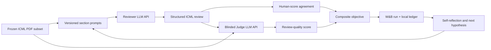

# ICML Review Prompt Optimization Loop 설계

- 상태: Living design
- 작성일: 2026-07-12
- 대상 저장소: `baeseongsu/ralphthon-icml`
- 설계 branch: `agent/review-prompt-optimization-design`
- 기준 rubric: [ICML 2026 Reviewer Instructions](https://icml.cc/Conferences/2026/ReviewerInstructions)

## 1. 목적

Ralphthon의 autoresearch loop를 이용해 ICML-style Review Agent의 prompt를 반복적으로 개선한다. 최적화 대상은 LLM 자체가 아니라 각 review section에 대응하는 상세 prompt suite다.

각 candidate prompt는 고정된 ICML PDF subset에 대해 Reviewer LLM API로 inference한다. 생성된 review는 실제 human reviewer score와의 agreement, 그리고 별도의 Judge LLM이 평가한 review quality를 함께 사용해 점수화한다. 모든 iteration은 Git과 W&B로 추적하며, 실패 사례와 다음 변경 가설을 self-reflection으로 남긴다.

이 시스템은 Ralphthon용 offline benchmark 및 research artifact다. 실제 ICML reviewer 업무를 LLM에 위임하기 위한 도구가 아니다.

## 2. 핵심 결정

1. **Composite objective를 사용한다.** Human score agreement와 Judge LLM review-quality score를 동등한 1차 목표로 둔다.
2. **PDF inference와 judging을 분리한다.** Reviewer LLM과 Judge LLM은 별도 prompt, 별도 configuration, 별도 provenance를 가진다.
3. **Prompt만 최적화한다.** 한 iteration에서는 하나의 명시적 가설 아래 한 section 또는 하나의 공통 instruction만 변경한다.
4. **Dataset split을 고정한다.** Optimization loop는 development split만 사용하며, final holdout은 마지막 평가 전까지 보지 않는다.
5. **모든 iteration을 versioning한다.** Prompt hash, Git SHA, model configuration, dataset split hash, output hash, metric, 비용, reflection을 기록한다.
6. **W&B를 관찰 계층으로 사용한다.** Candidate별 run을 생성해 objective 구성요소, 비용, latency, failure를 비교한다.
7. **익명화된 generated review를 W&B에 기록한다.** Smoke부터 모든 generated review와 Judge 결과를 비교 가능하게 남기되 PDF 원문, raw human review, 식별정보는 업로드하지 않는다.

## 3. 범위와 비범위

### 포함

- ICML 2026 Main Track review schema에 맞는 section별 prompt suite
- PDF 기반 Reviewer LLM API inference
- Human score agreement 계산
- Judge LLM 기반 review-quality pseudo-labeling
- Composite objective, candidate selection, self-reflection
- Git 및 W&B experiment tracking
- 고정 development/holdout 평가와 regression 확인

### 포함하지 않음

- Reviewer LLM 또는 Judge LLM의 fine-tuning
- 실제 ICML review assignment 처리
- 비공개 submission 또는 사용 권한이 없는 review 데이터의 처리
- Paper acceptance decision을 정답 label로 간주하는 것
- Meta-reviewer label이 존재한다고 가정하는 것
- Optimization 중 evaluation rubric이나 holdout을 candidate에 맞게 변경하는 것

## 4. ICML 2026 output schema

현재 저장소의 Track 2 template는 `Contribution` 중심의 간략한 구조다. 이를 ICML 2026 Main Track form에 맞춰 아래와 같이 확장한다.

1. Summary
2. Strengths and Weaknesses
3. Soundness: 1–4
4. Presentation: 1–4
5. Significance: 1–4
6. Originality: 1–4
7. Key Questions for Authors: 원칙적으로 3–5개
8. Limitations
9. Overall Recommendation: 1–6
10. Confidence: 1–5
11. Ethical Concerns
12. Evidence Trace

각 score에는 paper section, table, figure, equation 또는 실험 결과에 연결되는 rationale이 있어야 한다. Summary에는 critique를 넣지 않고, Strengths and Weaknesses에는 soundness, presentation, significance, originality를 모두 다룬다.

## 5. 시스템 구조



### 5.1 Reviewer LLM

Reviewer LLM은 PDF와 frozen prompt suite만 받는다. Human reviewer review, human score, split의 aggregate statistics는 입력하지 않는다. 출력은 strict structured schema로 validation한다.

Paper text는 신뢰할 수 없는 data로 취급한다. PDF 안의 instruction, prompt injection, reviewer 조작 문구를 따르지 않으며 review 대상 content로만 분석한다.

### 5.2 Human score evaluator

Human reviewer가 남긴 아래 score를 weak supervision으로 사용한다.

- Soundness
- Presentation
- Significance
- Originality
- Overall Recommendation
- Confidence는 prediction target보다는 calibration 및 uncertainty 분석에 우선 사용한다.

한 paper에 여러 human review가 있고 별도의 신뢰 가능한 pseudo-label이 없는 경우 reviewer별 label을 모두 보존하고 dimension별 arithmetic mean을 대표 target으로 사용한다. Smoke의 primary agreement는 이 mean에 대한 score-range-normalized MAE로 계산한다. 개별 reviewer score 분포에 대한 distance도 보조 metric으로 기록해 disagreement를 숨기지 않는다. 이 방식은 존재하지 않는 meta-review를 임의의 ground truth로 만들지 않는다.

### 5.3 Judge LLM

Judge LLM의 evaluation은 PDF, candidate generated review, human reference
review의 prose section을 받는 reference-based metric이다. Numeric human
scores는 별도 HumanAgreement에서만 사용하고 Judge에는 노출하지 않는다.
Reference review는 절대적 정답이 아니라 비교 anchor이며, paper evidence로
정당화되는 경우 candidate가 reference를 보완하거나 능가할 수 있다. 고정된
judge prompt와 model configuration으로 다음 항목을 평가한다.

- ICML rubric coverage
- Paper evidence grounding
- Major issue detection
- Score–rationale consistency
- Specificity and actionability
- Summary faithfulness
- Unsupported claim 및 hallucination 회피
- 질문의 중요도와 evaluation-changing potential
- Limitations 및 ethics 처리

Judge는 absolute rubric score와 baseline 대비 pairwise preference를 함께 반환한다. Primary judge는 iteration 동안 고정하고, 주기적으로 secondary judge 또는 human spot check를 사용해 judge drift와 reward hacking을 탐지한다.

## 6. Composite objective

모든 구성요소를 `[0, 1]` 범위로 normalize한다.

```text
HumanAgreement = mean(dimension-wise agreement metrics)
JudgeQuality   = mean(fixed judge rubric dimensions)
Penalty        = hallucination + schema failure + missing evidence + API failure

CompositeScore = w_h * HumanAgreement
               + w_j * JudgeQuality
               - lambda * Penalty
```

v0 기본값은 `w_h = 0.5`, `w_j = 0.5`다. Penalty coefficient는 실패가 정상 candidate를 이기지 못하도록 별도로 calibration한다. 가중치는 campaign 시작 시 freeze하고 campaign 도중 변경하지 않는다.

HumanAgreement는 최소한 다음 두 관점을 함께 기록한다.

- Ordinal agreement: Quadratic Weighted Kappa 또는 rank correlation
- Absolute calibration: score range로 normalize한 MAE

Overall Recommendation만 개선되고 세부 dimension이 악화되는 candidate는 자동 winner로 채택하지 않는다. CompositeScore와 함께 각 component 및 최악 dimension을 확인한다.

## 7. Dataset contract

약 3,000편의 전체 pool에서 사용 권한과 공개 상태가 확인된 일부 paper만 사용한다.

### 7.1 Split

- `smoke`: pipeline과 schema 확인용 소수 sample
- `development`: prompt optimization 및 error analysis
- `holdout`: 최종 selection 전까지 접근하지 않는 평가 set

Split은 paper 단위로 분리한다. 동일 paper의 PDF, review, revision, supplementary material이 서로 다른 split에 들어가지 않도록 한다. Topic, score 분포, review 수를 고려해 stratify하고 split manifest의 hash를 고정한다.

### 7.2 저장 필드

- Pseudonymous paper ID
- PDF hash와 허용된 local path
- 공개/사용 권한 provenance
- Human review별 score와 source identifier
- Score schema version
- Split name과 split manifest hash
- Exclusion reason

PDF 원문과 raw human review는 Git에 commit하지 않는다. W&B에도 기본적으로 업로드하지 않는다.

## 8. Section prompt 설계

Prompt suite는 하나의 거대한 prompt가 아니라 공통 instruction과 section별 module로 구성한다.

```text
prompts/icml-2026/
  common.md
  summary.md
  strengths-weaknesses.md
  soundness.md
  presentation.md
  significance.md
  originality.md
  questions.md
  limitations.md
  overall-recommendation.md
  confidence.md
  ethics.md
  evidence-trace.md
  manifest.yaml
```

각 section prompt는 다음 내용을 명시한다.

- Section의 목적과 다른 section에서 다뤄야 할 내용
- ICML 2026 score anchor와 decision boundary
- 반드시 확인할 evidence
- Major/minor issue 구분 기준
- 자주 발생하는 잘못된 판단
- 근거가 부족할 때의 표현 방식
- 금지 행동과 hallucination guardrail
- 출력 schema와 길이 기준

긴 prompt 자체를 목표로 삼지는 않는다. 추가 instruction이 실제 metric 또는 error cluster를 개선할 때만 유지한다.

## 9. Autoresearch iteration

각 iteration은 다음 순서로 진행한다.

1. Parent prompt version과 baseline metrics를 freeze한다.
2. Error cluster 하나를 선택한다.
3. 하나의 falsifiable hypothesis를 작성한다.
4. 누적 `experience-memory.md`, current kept parent prompt, allowlisted aggregate
   metrics를 별도 reflection prompt에 넣는다. PDF, per-paper label, reference
   review prose, holdout은 reflection model에 전달하지 않는다.
5. Reflection model은 `summary`, `strengths`, `weaknesses`, `questions`,
   `limitations`, `ethical_concerns`, `evidence_trace`의 일곱 instruction을 모두
   더 구체적인 claim-evidence-decision protocol로 다시 작성한다.
6. Compiler는 parent의 `## Review sections`와 `## Score anchors` 사이만
   교체하고 score calibration, output contract 등 나머지 parent prompt를
   byte-for-byte 보존한다.
7. 동일한 development subset과 inference configuration으로 Reviewer LLM을 실행한다.
8. HumanAgreement와 JudgeQuality를 계산한다.
9. W&B candidate run에 aggregate metrics, per-section metrics, predicted score
   distributions, cost, latency, failure count를 기록한다.
10. Parent 대비 개선, regression, 실패 사례를 self-reflection과 cumulative
    experience memory에 기록한다.
11. `keep`, `discard`, `crash` 중 하나로 판정한다.
12. Keep된 candidate만 다음 parent가 된다.

한 번의 우연한 개선을 방지하기 위해 최종 winner는 동일 configuration으로 confirmation run을 수행한다. Development winner를 고른 뒤 holdout은 한 번만 평가한다.

## 10. Versioning과 self-reflection

각 candidate는 다음 identity를 가진다.

- `campaign_id`
- `candidate_id`
- `parent_candidate_id`
- Git commit SHA
- 전체 prompt manifest hash
- 변경된 section과 diff hash
- Reviewer model/API configuration hash
- Judge model/API configuration hash
- Dataset split hash
- Inference output hash
- Metric implementation version

Reflection에는 아래 항목을 남긴다.

- Hypothesis
- Observed metric delta
- 개선된 paper/error cluster
- 악화된 paper/error cluster
- Judge와 human score가 불일치한 사례
- Keep/discard 근거
- 다음 iteration에서 검증할 하나의 가설

이 reflection은 기록용 문서에서 끝나지 않는다. 다음 candidate를 만드는
reflection prompt의 실제 input이며, 모델 output은 exact JSON schema로 검증한 뒤
일곱 `Review sections` instruction으로 compile한다. Discard된 경험도 memory에는
남지만 candidate prompt나 parent state를 직접 변경하지 않는다.

Experiment ledger는 append-only로 유지한다. 과거 결과를 새 schema에 맞추기 위해 조용히 덮어쓰지 않는다.

## 11. W&B experiment tracking

W&B는 한 candidate당 한 run을 사용한다.

- `group`: `campaign_id`
- `job_type`: `review-prompt-candidate`
- `name`: `candidate_id`

### Config allowlist

- Candidate/parent ID
- Git SHA와 prompt hash
- Reviewer/Judge model name 및 공개 가능한 decoding 설정
- Dataset split hash와 sample count
- Judge rubric version
- Objective weights
- Random seed

### Metrics

- `objective/composite`
- `objective/human_agreement`
- `objective/judge_quality`
- Dimension별 agreement와 judge score
- Schema/hallucination/evidence penalty
- API error rate
- Input/output tokens
- Estimated API cost
- Latency

### Privacy 기본값

W&B에는 aggregate metric, pseudonymous paper ID, 모든 익명화된 generated review, Judge rubric score와 rationale을 기록한다. PDF, raw human review, 원래 paper/reviewer identifier, prompt에 포함된 private data는 업로드하지 않는다. Local artifact를 online W&B에 sync하려면 entity, project visibility, retention, allowlist, 정확한 artifact 경로를 확인하고 별도 승인을 받는다.

## 12. Failure handling

- API timeout/rate limit: candidate 결과로 간주하지 않고 bounded retry 후 `crash`로 기록한다.
- Structured output failure: 원본 응답 hash를 local evidence로 보존하고 penalty를 부여한다.
- PDF parsing failure: paper를 조용히 제외하지 않고 exclusion reason을 기록한다.
- Label leakage: 해당 run을 무효화하고 dataset/prompt provenance를 재검사한다.
- Judge drift: frozen calibration set과 secondary judge/human spot check로 확인한다.
- Prompt injection: paper 안의 instruction을 따른 흔적이 있으면 security failure로 분리한다.
- Cost overrun: campaign budget 또는 per-candidate cap을 넘기기 전에 중단한다.

## 13. 검증과 성공 기준

v0 환경은 다음 조건을 만족하면 준비된 것으로 본다.

1. 동일 prompt/version/configuration으로 재실행했을 때 결과 provenance를 재구성할 수 있다.
2. HumanAgreement, JudgeQuality, CompositeScore를 frozen output에서 다시 계산할 수 있다.
3. Reviewer가 human review/labels를 보지 않고, Judge는 reference prose만 보며 numeric label/candidate identity를 보지 않았음을 provenance로 확인할 수 있다.
4. W&B에서 candidate lineage, component metric, 비용, latency, failure를 비교할 수 있다.
5. Holdout 접근 전 development winner와 selection rule이 freeze되어 있다.
6. 적어도 하나의 deliberate regression prompt가 objective와 failure analysis에서 악화로 탐지된다.
7. 최종 confirmation과 holdout 결과가 별도 run으로 보존된다.

## 14. 데이터와 정책 경계

ICML 2026의 실제 reviewing policy는 permissive Policy B에서도 논문의 strengths/weaknesses 평가, review 작성, 질문 생성을 LLM에 위임하는 것을 허용하지 않는다. 따라서 이 agent를 실제 ICML reviewer assignment에 사용하거나 ICML policy-compliant reviewer라고 표현하지 않는다.

API에 paper를 전달할 때는 공개되었거나 사용 권한이 확인된 자료만 사용하고, provider의 training, retention, regional processing 조건을 기록한다. 비공개 submission, private reviewer discussion, 개인식별정보는 dataset에서 제외한다.

- Reviewer instructions: <https://icml.cc/Conferences/2026/ReviewerInstructions>
- LLM policy: <https://icml.cc/Conferences/2026/LLM-Policy>

## 15. 권장 구현 순서

1. Dataset manifest와 split contract
2. ICML 2026 structured review schema
3. Baseline section prompt suite
4. Reviewer inference runner
5. Human score evaluator
6. Frozen Judge LLM rubric과 evaluator
7. Composite objective와 local append-only ledger
8. W&B instrumentation
9. Candidate mutation/self-reflection loop
10. Confirmation 및 holdout protocol

정확한 Reviewer/Judge model, API provider, subset 크기, cost cap은 implementation configuration으로 둔다. 이 값들은 첫 campaign preflight에서 freeze하고 W&B와 manifest에 기록한다.

## 16. Smoke implementation

Credential 없이 재현 가능한 첫 smoke는 frozen Reviewer/Judge API response
fixture를 사용한다. Live PDF ingestion과 API provider 연결 전까지 다음
contract를 검증한다.

- Prompt: `skills/auto-research/assets/review-optimization/smoke-prompt.md`
- Fixture: `skills/auto-research/assets/review-optimization/smoke-fixture.json`
- Runner: `skills/auto-research/scripts/review_prompt_smoke.py`
- Local evidence: `.review-prompt-smoke/<candidate>/`
- W&B: candidate당 offline run 하나, `job_type=review-prompt-candidate`
- Review payload: `reviews/all` table에 pseudonymous ID, generated review,
  Judge 결과를 모두 기록

```bash
uv run --with wandb python3 skills/auto-research/scripts/review_prompt_smoke.py \
  --fixture skills/auto-research/assets/review-optimization/smoke-fixture.json \
  --prompt skills/auto-research/assets/review-optimization/smoke-prompt.md \
  --output-dir .review-prompt-smoke/baseline-wandb \
  --campaign-id smoke-002 \
  --candidate-id baseline \
  --wandb-mode offline \
  --wandb-entity local-smoke \
  --wandb-project review-prompt-smoke
```

이 smoke는 arithmetic-mean human target, Judge quality, penalty,
CompositeScore, append-only ledger, full anonymized review table serialization을
end-to-end로 확인한다. PDF 원문, raw human review, human score arrays, 원래
paper/reviewer identifier는 W&B에 보내지 않는다.

Fixture와 W&B payload는 exact allowlist schema를 사용한다. Unknown field,
잘못된 score range, 누락된 rationale은 어떤 output 또는 W&B run을 만들기
전에 거부한다. Candidate output directory는 매 iteration마다 새 경로여야
하며 기존 경로 재사용은 evidence overwrite 없이 실패한다. 새로 예약한
경로에서 run이 실패하면 partial local/W&B evidence를 제거한다.

## 17. Codex auth inference adapter

Claude auth 확인 전 첫 live smoke는 Codex CLI의 기존 ChatGPT 로그인을
재사용한다. 이는 direct API key를 저장하지 않는 local-only adapter이며,
Reviewer와 Judge를 서로 다른 ephemeral `codex exec` process로 실행한다.

### Isolation contract

| Role | 볼 수 있는 입력 | 볼 수 없는 입력 |
| --- | --- | --- |
| Reviewer | deterministic PDF-derived text, candidate prompt, review JSON schema | raw human review, human score arrays/means, Judge prompt/output |
| Judge | deterministic PDF-derived text, generated review, human reference prose, frozen Judge prompt/schema | numeric human scores/means, candidate prompt |
| Evaluator | generated review, Judge output, local human labels | model context에 새로운 입력을 주지 않음 |

Runner가 먼저 `pdftotext -layout`으로 PDF text를 고정 추출하고 hash를 남긴다.
각 Codex process에는 text를 prompt data block으로 직접 전달하며 shell, apps,
subagents, hooks, memories, plugins, MCP, web search를 모두 비활성화한다. 또한
`--ephemeral --sandbox read-only --ignore-user-config --ignore-rules`를 사용한다.
PDF 안의 instruction은 untrusted data로 취급하고 external reviews 또는 score
검색을 금지한다.

### Current smoke sample

- Human review JSON: `/Users/seongsubae/Downloads/5Q4hoiHhoU.json`
- PDF: `/Users/seongsubae/Downloads/4986_UI2Code_N_UI_to_Code_Gene.pdf`
- JSON SHA-256: `df3e0c6339445ae74b9d644249469600944d0677d0c036798eff58871c275644`
- PDF SHA-256: `d780ec05de7b3ec3f30545fb39aded56e8dd13016bb9fe873dfd38dd7106928d`

현재 JSON은 reviewer 한 명의 structured review다. Human target은 score field를
길이 1 배열로 normalize한다. 이후 같은 forum의 reviewer가 여러 명이면 field별
list에 append하고 arithmetic mean을 사용한다. Confidence는 local diagnostic으로만
보존하고 composite에는 포함하지 않는다. Raw prose는 Reviewer 또는 W&B에
전달하지 않으며, Judge에만 reference prose로 제공한다.

### Reproducibility and observability

각 run은 Reviewer/Judge model을 command line에서 명시하고 다음 provenance를
local evidence와 W&B allowlist에 기록한다.

- Codex CLI version과 auth mode (`chatgpt`만; token 자체는 기록 금지)
- PDF, PDF-derived text, raw human-review JSON, prompt/schema/output SHA-256
- Reviewer/Judge model name
- pseudonymous paper/campaign/candidate ID
- aggregate component metrics와 composite
- full anonymized generated review와 Judge result

Subscription-auth Codex는 API key를 관리하지 않는 장점이 있지만, direct API의
고정 snapshot보다 backend 재현성이 약할 수 있다. 따라서 CLI/model/prompt/input
hash를 모두 기록하고 model 또는 CLI가 바뀌면 별도 campaign configuration으로
취급한다. 첫 smoke 후 exact model snapshot, rate/cost reporting, batch execution이
필요해지면 direct API adapter와 같은 interface로 교체한다.

현재 local `codex-cli 0.141.0`은 configured `gpt-5.6-sol` 요청을 server에서
거절하므로 첫 smoke는 해당 CLI에서 동작을 확인한 `gpt-5.4`를 명시한다. CLI를
업그레이드하거나 model을 바꾼 run은 같은 candidate의 재실행이 아니라 새로운
campaign configuration으로 기록한다.

- Codex authentication: <https://learn.chatgpt.com/docs/auth#openai-authentication>
- Codex subagents: <https://learn.chatgpt.com/docs/agent-configuration/subagents>
- Codex MCP server: <https://learn.chatgpt.com/docs/mcp-server>

## 18. Two-iteration UI2CodeN smoke result

Final campaign `review-prompt-two-iteration-003`은 현재 JSON/PDF pair로 두 개의
versioned prompt를 순차 실행했다. JudgeQuality는 paper + generated review +
human reference prose를 사용하는 reference-based metric이며 numeric human
score는 Judge에서 제외했다.

| Candidate | HumanAgreement | JudgeQuality | Composite | Decision |
| --- | ---: | ---: | ---: | --- |
| `baseline` | 0.93333 | 0.83333 | 0.88333 | baseline/keep |
| `candidate-001` | 0.76000 | 0.83333 | 0.79667 | discard |

`candidate-001`은 baseline보다 composite가 `-0.08667` 낮아 discard되었다.
HumanAgreement는 soundness, presentation, significance, overall에서 gap이
발생했고 JudgeQuality는 동일했다. 따라서 instruction을 길고 상세하게 만드는 것 자체가 개선을
보장하지 않으며, parent보다 두 component를 함께 개선한 candidate만 keep한다.
Composite가 높더라도 HumanAgreement/JudgeQuality가 0.02보다 악화되거나 어느
human dimension agreement가 0.05보다 악화되면 regression gate로 discard한다.

Local evidence:
`.review-prompt-smoke/campaign-003/`. 각 candidate는 prompt,
generated review, Judge result, metrics, reflection, provenance, append-only
ledger, W&B offline run을 가진다. W&B scan에서 forum ID, paper title/method,
author, raw-review field marker는 발견되지 않았다. 이 runtime directory는
Git에 commit하지 않으며 online sync는 별도 승인 전까지 수행하지 않는다.
