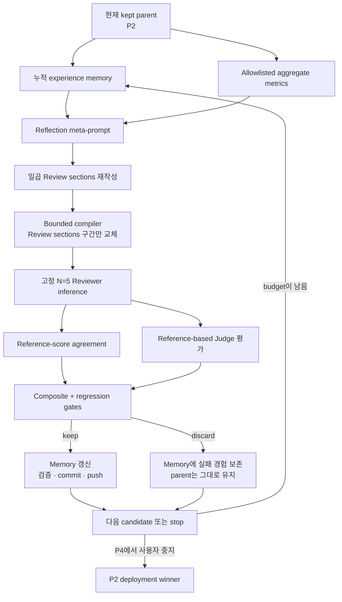

# ICML Review Prompt Optimization Loop

- 작성일: 2026-07-12
- 상태: P4에서 loop 종료, P2를 최종 kept parent이자 deployment winner로 선택
- 목적: ICML-style Reviewer prompt를 반복적으로 개선하되, 작은 development smoke의 결과를 일반 성능 주장으로 과장하지 않고 모든 선택 근거를 재현 가능하게 남긴다.

## 한눈에 보는 원칙

- 최적화 대상은 Reviewer/Judge 모델이나 평가식이 아니라 Reviewer의 prompt다.
- 현재 smoke는 고정된 development sample `N=5`를 모든 candidate에 동일하게 사용한다.
- 각 candidate는 reference-score agreement와 reference-based Judge review quality를 함께 최대화한다.
- Composite가 올라도 component 또는 개별 score dimension이 허용 범위보다 악화되면 discard한다.
- Keep된 candidate만 다음 parent가 된다. Discard된 candidate의 실패 원인은 누적 experience memory에 남는다.
- P3와 P4에서는 memory를 사람이 참고하는 데 그치지 않고, 전용 reflection meta-prompt의 실제 입력으로 사용했다.
- Reflection 결과는 일곱 `Review sections` 전체를 다시 작성하며, compiler는 parent prompt의 해당 구간만 교체한다.
- W&B는 관찰 계층이다. 선택 결과는 W&B 없이도 local evidence에서 동일하게 재계산할 수 있어야 한다.
- Keep가 확정된 prompt와 sanitized decision만 검증 후 Git commit/push한다.
- 이번 campaign은 사용자 지시에 따라 P4에서 중단했으며, P3와 P4는 진단용 experimental artifact로만 남긴다.

## 전체 흐름



## 고정된 실험 경계

- 현재 유효 pool은 development와 sealed holdout으로 paper 단위 분리되어 있다.
- Development pool에서 결정론적으로 뽑은 동일한 `N=5` sample을 P0, P1, P2 및 후속 smoke candidate에 사용한다.
- Sample 순서와 manifest hash를 inference 전에 고정한다. Candidate 사이에 sample이나 순서를 바꾸지 않는다.
- Holdout은 optimizer, reflection model, Reviewer, Judge가 볼 수 없는 sealed artifact로 유지한다.
- Reviewer model, Judge model, Judge rubric, structured-output schema, objective weights, regression thresholds, decoding/inference configuration을 campaign 도중 바꾸지 않는다.
- 모델, schema, dataset split, 평가식 중 하나라도 바뀌면 기존 candidate의 단순 연속이 아니라 새로운 campaign configuration으로 취급한다.
- 한 paper에 여러 reference score가 있고 신뢰할 별도 meta-label이 없으면 dimension별 arithmetic mean을 대표 target으로 사용한다. 원래 score 분포와 reviewer disagreement는 local diagnostic으로만 보존한다.

## Reviewer, Judge, Evaluator, Reflection의 역할 분리

- **Reviewer**
  - 입력: PDF에서 결정론적으로 추출한 text와 candidate prompt.
  - 출력: strict schema를 따르는 ICML-style structured review와 ordinal score 예측.
  - 차단 정보: reference review prose, reference score, score 분포, Judge prompt/output.
  - Paper 내부의 instruction은 untrusted content로 취급하며 실행하지 않는다.

- **Judge**
  - 입력: 동일 paper evidence, generated review, reference review prose, 고정 Judge rubric.
  - 평가 대상: paper의 품질이 아니라 generated review 자체의 품질.
  - 차단 정보: numeric reference score, candidate prompt, candidate identity.
  - Reference review는 절대 정답이 아니라 비교 anchor다. Generated review가 paper evidence로 정당화된다면 reference를 보완하거나 능가할 수 있다.

- **Evaluator**
  - Local에서만 predicted score와 reference target의 agreement, Judge output, penalty를 결합한다.
  - 모델 context에 reference score를 새로 전달하지 않는다.

- **Reflection model**
  - 입력: 현재 kept parent prompt, cumulative `experience-memory`, allowlisted aggregate metrics.
  - 차단 정보: PDF/text, per-paper prediction, per-paper label, reference prose, source identifier, sealed holdout.
  - 출력: 하나의 bounded hypothesis와 일곱 Review-section instruction을 포함하는 exact-schema JSON.

## Objective 계산

- Reference-score agreement는 다섯 dimension을 사용한다.
  - `soundness`, `presentation`, `significance`, `originality`, `overall_recommendation`.
  - Dimension별 agreement는 score range로 normalize한다.

```text
dimension_agreement = 1 - abs(predicted - reference_target) / (max_score - min_score)
HumanAgreement      = mean(five dimension agreements)
```

- `confidence` 예측과 분포는 기록하지만 objective에는 포함하지 않는다. Confidence는 review certainty이지 paper quality가 아니기 때문이다.
- Judge는 고정된 9개 review-quality dimension을 1–5로 평가한다. 각 값을 `[0, 1]`로 normalize한 뒤 평균한다.

```text
normalized_judge_dimension = (judge_score - 1) / 4
JudgeQuality               = mean(nine normalized judge dimensions)
```

- Penalty는 hallucination, schema failure, missing evidence, API failure 네 값의 평균이다.
- Candidate 수준에서는 paper별 결과를 macro-average한 뒤 Composite를 다시 계산한다.

```text
Composite = clamp(
    0.5 * HumanAgreement
  + 0.5 * JudgeQuality
  - 0.25 * Penalty,
  0,
  1
)
```

## Keep / discard gate

- Candidate는 다음 조건을 모두 통과해야 keep된다.
  - Composite가 현재 kept parent보다 엄격히 높다.
  - HumanAgreement가 parent보다 `0.02` 초과 악화되지 않는다.
  - JudgeQuality가 parent보다 `0.02` 초과 악화되지 않는다.
  - 어느 reference-score dimension agreement도 parent보다 `0.05` 초과 악화되지 않는다.
  - Frozen sample을 전부 완료하고 schema, provenance, privacy 검증을 통과한다.
- 위 조건 중 하나라도 실패하면 Composite가 높더라도 discard한다.
- Discard 후 parent는 바뀌지 않는다. 다음 candidate는 마지막 kept parent에서 다시 생성한다.
- API/schema failure로 완전한 candidate evidence를 만들지 못하면 성능 비교에 억지로 포함하지 않고 `crash`로 기록한다.

## P0–P4의 aggregate 결과

| Candidate | Composite | Reference-score agreement | Judge review quality | 판정 |
| --- | ---: | ---: | ---: | --- |
| P0 | 0.895111 | 0.901333 | 0.888889 | baseline |
| P1 | 0.926889 | 0.909333 | 0.944444 | discard |
| P2 | 0.946556 | 0.965333 | 0.927778 | keep |
| P3 | 0.948556 | 0.936000 | 0.961111 | discard: component regression |
| P4 | 0.939111 | 0.922667 | 0.955556 | discard: no Composite gain |

- **P0**는 campaign baseline이다.
- **P1**은 Composite와 두 component가 개선됐지만, significance agreement가 P0 대비 `-0.066667` 악화되어 `0.05` dimension gate를 넘었다. 따라서 discard되었다.
- **P1에서 얻은 경험**은 “공통 scoring rule이 한 dimension의 과대평가를 만들 수 있으며, Composite 상승만으로 이를 덮으면 안 된다”는 것이다.
- **P2**는 significance를 soundness나 originality에서 독립적으로 calibration하는 positive-evidence burden을 도입했다.
- P2는 P0 대비 Composite `+0.051444`, reference-score agreement `+0.064000`, Judge review quality `+0.038889`를 기록했고 모든 regression gate를 통과했다.
- **P3**는 memory-driven reflection으로 일곱 Review-section instruction을 모두 `claim → evidence → decision relevance` 중심으로 확장했다. P2 대비 Composite는 `+0.002000`, Judge review quality는 `+0.033333`이었지만 reference-score agreement가 `-0.029333`으로 component 허용치 `0.02`를 넘게 악화됐다. Overall recommendation agreement `-0.080000`, soundness agreement `-0.066667`의 dimension regression도 함께 발생해 discard했다.
- **P4**는 P3의 과도한 instruction pressure를 줄인 lighter-weight rewrite였지만 P2 대비 Composite가 `-0.007444`로 낮아져 `no_composite_gain`으로 discard했다. Judge review quality는 `+0.027778`이었으나 reference-score agreement는 `-0.042667`, soundness agreement는 `-0.133333`, overall recommendation agreement는 `-0.080000`으로 악화됐다.
- **최종 결정**: 현재 kept parent와 deployment winner는 **P2**다. P3와 P4는 reflection mechanism과 실패 양상을 보여 주는 experimental artifact이며 배포 prompt가 아니다.
- 이번 campaign은 사용자 지시에 따라 **P4에서 종료**했다. P5는 생성하거나 평가하지 않는다.
- 이 결과는 5편 development smoke에 한정된 operational evidence이며 일반적인 prompt 우월성의 증거가 아니다.

## Experience memory와 최신 reflection 반영

- `experience-memory`는 매 candidate 판정 뒤 누적 재생성한다.
- Baseline과 모든 후속 candidate에 대해 다음 aggregate 경험을 보존한다.
  - Candidate와 parent 관계.
  - 사전에 작성한 falsifiable hypothesis와 실제 prompt intervention.
  - Keep, discard, crash 판정과 rejection reason.
  - Composite, HumanAgreement, JudgeQuality delta.
  - Dimension별 agreement delta.
  - 보존할 gain, 반복하면 안 될 failure mode, 다음 candidate constraint.
- Discard는 삭제가 아니다. Prompt는 parent가 되지 않지만 실패 이유는 memory에 남아 다음 reflection의 제약으로 작동한다.
- P3부터 전용 reflection meta-prompt가 다음 세 입력을 함께 소비한다.
  - 현재 kept parent prompt.
  - 누적 aggregate experience memory.
  - 민감 필드를 제거한 allowlisted aggregate metric snapshot.
- Reflection은 한 번에 하나의 검증 가능한 개선 가설을 선택한다.
- Reflection output은 exact JSON schema로 검증하며, 다음 일곱 section을 모두 더 구체적인 `claim → evidence → decision relevance` protocol로 다시 작성해야 한다.
  - `summary`
  - `strengths`
  - `weaknesses`
  - `questions`
  - `limitations`
  - `ethical_concerns`
  - `evidence_trace`
- `summary`는 여전히 critique를 포함하지 않는다. 나머지 section도 체크리스트 길이 자체가 아니라 central claim을 지지·반박·재현·구분·안전하게 scope하는 정보만 요구한다.
- Compiler는 parent prompt의 `## Review sections`와 `## Score anchors` 사이만 bounded replacement한다.
- Score anchors, P2의 calibration pass, security rule, output contract 등 나머지 parent text는 그대로 보존한다.
- 일곱 section 중 하나라도 바뀌지 않았거나 충분히 구체화되지 않으면 candidate prompt 생성을 거부한다.
- P3의 memory에는 component 및 soundness/overall-recommendation regression을, P4의 memory에는 Composite 감소와 더 큰 soundness regression을 보존했다. Loop는 종료됐지만 이 경험은 향후 별도 campaign의 hypothesis 제약으로 재사용할 수 있다.

## P3와 P4에 적용한 iteration lifecycle

- **1. Parent freeze**: 현재 campaign state가 가리키는 kept parent, prompt hash, aggregate hash를 확인한다.
- **2. Reflection proposal**: memory와 aggregate snapshot으로 다음 한 가지 hypothesis 및 일곱 section rewrite를 생성한다.
- **3. Compile and validate**: exact schema 검증 후 bounded compiler로 candidate prompt를 만들고 prompt/reflection/provenance hash를 남긴다.
- **4. Frozen N=5 inference**: 동일 sample과 configuration으로 Reviewer를 실행한다. Paper별 bounded retry는 허용하지만 조용한 sample 제외는 허용하지 않는다.
- **5. Reference-based judging**: 각 generated review를 고정 Judge가 reference prose와 paper evidence를 기준으로 평가한다.
- **6. Aggregate scoring**: agreement, JudgeQuality, penalty, score distributions, signed gaps, latency/usage를 집계한다.
- **7. Gated decision**: 현재 kept parent와 비교해 keep, discard, crash 중 하나를 결정한다.
- **8. Memory update**: 성공과 실패 모두 경험으로 기록한다. 특히 discard 원인과 다음 candidate constraint를 남긴다.
- **9. Observability**: allowlist와 privacy scan을 통과한 pseudonymized review, distributions, aggregate metric을 W&B candidate run으로 기록한다.
- **10. Versioning**:
  - Keep: 전체 검증 후 prompt와 sanitized decision을 하나의 전용 commit으로 만들고 campaign branch에 push한다.
  - Discard/crash: deployment parent로 승격하지 않는다. Local/W&B evidence와 memory를 보존하고, sanitized prompt/reflection을 연구 기록으로 남길 때는 experimental artifact임을 명시한다.
- **11. Continue or stop**: Budget과 stop 조건이 허용하면 keep 시 새 parent에서, discard 시 기존 parent에서 다음 `P(k+1)` reflection을 시작한다. 이번 campaign은 P3와 P4가 연속 discard된 뒤 사용자 지시에 따라 P4에서 종료했다.

## W&B 관찰 항목과 privacy 경계

- Candidate당 하나의 private, access-controlled W&B run을 사용한다.
- 다음 항목을 기록한다.
  - Composite, HumanAgreement, JudgeQuality, penalty.
  - Dimension별 agreement와 Judge score.
  - Reviewer predicted score의 counts/frequencies와 Judge score distributions.
  - Reference score는 paper와 연결되지 않은 aggregate counts/frequencies만 허용한다.
  - Pseudonymous paper ID와 generated review, Judge result를 담은 review table.
  - Wall-clock, paper latency, throughput, token usage, attempt/retry/failure count.
  - Candidate/parent lineage, 공개 가능한 model/configuration, prompt와 manifest hash.
- 다음 항목은 W&B에 보내지 않는다.
  - PDF bytes, extracted paper text, raw reference JSON, raw reference prose.
  - Per-paper reference target이나 reviewer score array.
  - 원래 paper/reviewer identifier, filename, title, author.
  - Local path, environment secret, API key, console log, source artifact.
- Generated scientific review는 exact identifier를 제거해도 내용상 재식별 가능성이 남는다. 따라서 이를 완전한 anonymization이 아니라 **pseudonymization**으로 표현하고 project를 private으로 유지한다.
- Online sync 전 exact payload를 privacy scan하고, sync 후 authenticated readback과 비인증 접근 차단을 확인한다.
- W&B 장애나 logging 차이는 keep/discard 계산을 바꾸지 않아야 한다. Local frozen evidence가 selection의 source of truth다.

## Git과 재현성 정책

- 모든 candidate는 candidate ID, parent ID, prompt hash, model/configuration hash, sample manifest hash, output hash, aggregate hash를 가진다.
- Keep된 candidate는 검증 결과와 sanitized aggregate decision을 함께 commit/push한다.
- Commit은 “한 keep, 한 commit” 단위를 유지하여 어떤 prompt가 어떤 decision evidence에 대응하는지 추적 가능하게 한다.
- Discard/crash candidate의 민감 runtime output은 Git에 올리지 않는다.
- P3와 P4처럼 보존하는 discard candidate는 진단 및 재현을 위한 **experimental artifact**로 명시하며, deployment lineage나 current parent로 표시하지 않는다.
- Discard의 meta-level lesson은 누적 memory에 남아 이후 reflection에 사용되므로, 실패한 실험을 반복하거나 결과를 조용히 지우지 않는다.
- Runtime evidence는 새 candidate directory에 append-only로 생성하며 기존 결과를 overwrite하지 않는다.

## Stop 조건

- 이번 `N=5` campaign은 사용자 지시에 따라 P4에서 중단했다. 종료 시점의 current parent와 deployment winner는 P2이며, P3/P4는 각각 discard 상태다.
- 사용자가 중지를 요청하거나, campaign 시작 전에 freeze한 iteration/time budget에 도달하면 중단한다.
- Campaign controller가 연속 discard 수를 기록한다. Unattended loop를 시작하기 전에는 허용할 연속 discard 수를 명시적으로 freeze하고, 그 한도에 도달하면 새 candidate 생성을 멈추고 memory와 가설 공간을 재검토한다.
- 다음 integrity/privacy failure가 발생하면 즉시 중단하고 원인을 수정한다.
  - Frozen sample, model, schema, Judge rubric, objective 또는 threshold drift.
  - Reviewer/Judge/reflection 사이의 금지 정보 leakage.
  - Manifest/hash 불일치 또는 결과 재계산 불일치.
  - Privacy scan에서 forbidden identifier, reference data, secret 발견.
  - 잘못된 W&B destination 또는 비인증 외부 접근 가능 상태.
- Bounded retry 후에도 `5/5`를 완성하지 못하거나 schema-valid output을 확보하지 못하면 해당 candidate를 crash 처리하고 무한 재시도하지 않는다.
- Provider/platform incompatibility, 승인된 비용·시간 한도 초과 위험, deadline 도달 시 중단한다.

## N을 키우는 조건과 최종 평가

- `N=5`는 빠른 prompt-debugging과 operational smoke를 위한 크기다. 이 결과만으로 general improvement를 주장하지 않는다.
- N을 늘리기 전에 다음을 확인한다.
  - 여러 candidate에서 `5/5` completion과 bounded retry가 안정적으로 동작한다.
  - Metric을 paper-level frozen evidence에서 다시 계산했을 때 저장된 aggregate 및 hash와 일치한다.
  - W&B distributions, review table, timing/usage가 허용된 schema와 privacy gate를 계속 통과한다.
  - Runtime과 throughput을 바탕으로 확대된 sample의 예상 시간과 비용이 남은 budget 안에 든다.
  - Reflection이 paper-specific rule을 만들지 않고 aggregate failure mode만 사용한다.
- N을 늘릴 때는 expanded development manifest와 configuration을 다시 freeze하고, 현재 parent를 expanded baseline으로 재평가한 뒤 candidate 비교를 시작한다.
- Development sample을 키우는 과정에서도 sealed holdout은 열지 않는다.
- 최종 development winner는 동일 configuration으로 confirmation run을 수행한다.
- Selection rule과 winner를 고정한 뒤 holdout은 한 번만 평가하며, holdout 결과로 다시 prompt를 튜닝하지 않는다.

## 해석 경계

- 이 loop는 review prompt optimization 연구를 위한 offline benchmark다.
- Reference score와 review prose는 weak supervision 및 comparison anchor이지 완전한 ground truth가 아니다.
- Judge score는 review quality의 proxy이므로 reward hacking이나 Judge drift 가능성이 있다. 최종 단계에서는 secondary Judge 또는 human spot check가 필요하다.
- Prompt가 길어지는 것 자체는 성공 기준이 아니다. Gated objective를 개선하고 failure mode를 줄이는 instruction만 유지한다.
- 실제 학회 reviewer assignment에 LLM review 작성을 위임하는 용도로 사용하지 않는다.
