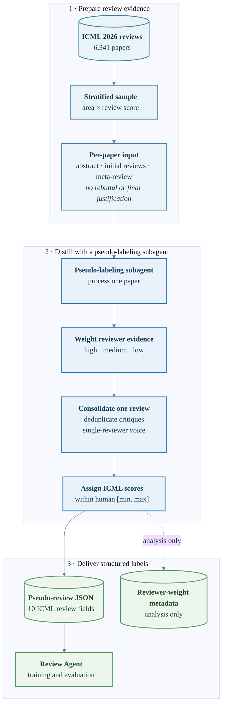

# Pseudo-labeling subagent pipeline

**Suggested caption.** Pseudo-labeling workflow. A stratified ICML review sample
is processed by a pseudo-labeling subagent. Reviewer evidence is weighted and
deduplicated before producing a single structured review whose scores are
constrained by the human-review range. The pseudo-review is used downstream,
while reviewer-weight metadata is retained only for analysis.
